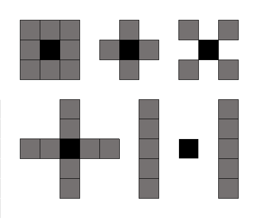
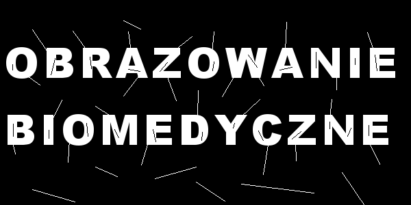
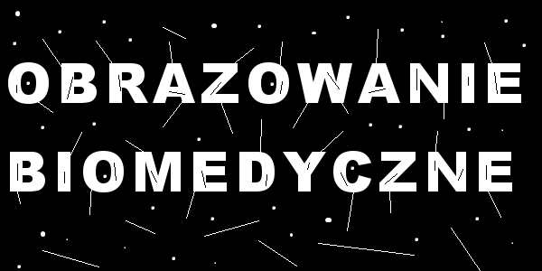

# Laboratorium drugie

> Na dzisiejszych zajęciach będą Państwo pracować z przekształceniami morfologicznymi w obrazach monochromatycznych. 

Przekształcenia morfologiczne są jednymi z ważniejszych operacji przetwarzania obrazów, gdyż pozwalają przeprowadzić zaawansowaną analizę kształtów poszczególnych obiektów oraz odległości między nimi. Podstawowe przekształcenia morfologiczne można ze sobą łączyć, co daje podstawę do budowania skomplikowanych systemów analizy obrazu.

## Element strukturalny

Operacje morfologiczne potrzebują dwóch wejść - obrazu, który ma zostać przetworzony oraz elementu strukturalnego lub jądra. Elementem strukturalnym może być dowolny kształt z oznaczonym punktem centralnym. 

Wykorzystywane jest to jako okno, do skanowania przetwarzanego obrazu punkt po punkcie. Podobnie jest z jądrem, które w uproszczeniu można potraktować jako macierz/tablicę. Taki element przechodzi po całym obrazie i dla każdego punktu dokonuje porównania punktów obrazu z punktami elementu strukturalnego. W przypadku wykrycia zgodności elementu strukturalnego z punktami na obrazie dokonywana jest pewna operacja na badanym punkcie. Podstawowe operacje morfologiczne to erozja i dylatacja. 

## Dylatacja

Operacja ta przykłada obrócony element strukturalny do każdego piksela na obrazie. Jeżeli choć jeden piksel z sąsiedztwa objętego przez okno ma wartość równą jeden, punkt centralny również otrzymuje wartość jeden. W przeciwnym wypadku przypisywane jest mu zero.

## Erozja

Operacja ta przykłada obrócony element strukturalny do każdego piksela na obrazie. Jeżeli choć jeden piksel z sąsiedztwa objętego przez okno ma wartość równą zero, punkt centralny również otrzymuje wartość zero. W przeciwnym wypadku jego wartość nie ulega zmianie.

## Otwarcie i domknięcie

Otwarcie morfologiczne jest równoważne nałożeniu operacji dylatacji na wynik erozji obrazu pierwotnego. 

Domknięcie działa podobnie jednak w odwrotnej kolejności, najpierw erozja potem dylatacja.

## Lista zadań

1. Zadania realizują Państwo przez implementację modułu `solution.py`, który na tę chwilę zawiera jedynie puste funkcje z ich interfejsami.
2. Deklaracją rozwiązania każdego z zadań jest odkomentowanie jego sekcji w skrypcie `check.py`.
3. Po wykonaniu każdego z zadań należy uruchomić skrypt `check.py`, zapisując do katalogu `results` wyniki działania funkcji z modułu `solution.py`.
4. Po zrealizowaniu zadań należy zacommitować zmiany i wypchnąć je na repozytorium, a następnie zgłosić to prowadzącemu do oceny.
5. Podstawą oceny jest zawartość pliku `solution.py` oraz katalogu `results`.

## Zadania na ocenę dostateczną

Zadanie polega na praktycznym zastosowaniu przekształceń morfologicznych. Stare drukowane zdjęcia z czasem niszczeją. Przenieśmy się teraz w czasie i spójrzmy na "zdjęcie" wykonane kilka lat temu:

Każdego roku skanowałem to zdjęcie po to, aby zobaczyć jakie powstają zniszczenia w czasie:

1. 

2. 

3. 

4. 

Wasze zadanie polega na tym, żeby uzyskać efekt najbardziej zbliżony do oryginału z tych 4 zniszczonych obrazów. Należy do tego wykorzystać różne operacje morfologiczne wykonywane w odpowiednich kolejnościach i ustawieniach. Do tego zadania można wykorzystać tylko operacje morfologiczne z biblioteki openCV i scikit-image. Rezultaty proszę zapisać do katalogu `results`.

## Zadanie na ocenę dobrą

Kolejnym zadaniem jest napisanie własnej, ale dość uproszczonej metody do erozji na obrazy binarne. Metoda erozji, która zawsze używa takiego jądra:

|  0   |  1   |  0   |
| :--: | :--: | :--: |
|  1   |  1   |  1   |
|  0   |  1   |  0   |

## Zadanie na ocenę bardzo dobrą

Zadanie to polega na modyfikacji poprzedniego zadania tak, aby można było podać jako parametr własne jądro w postaci macierzy.
